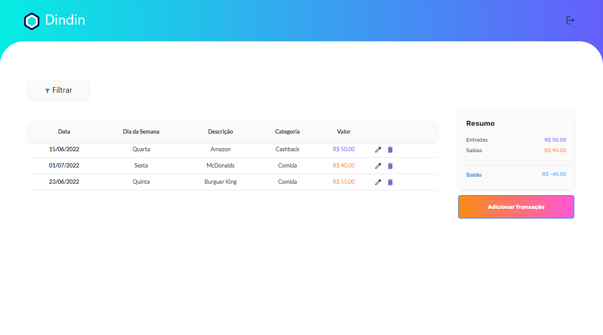
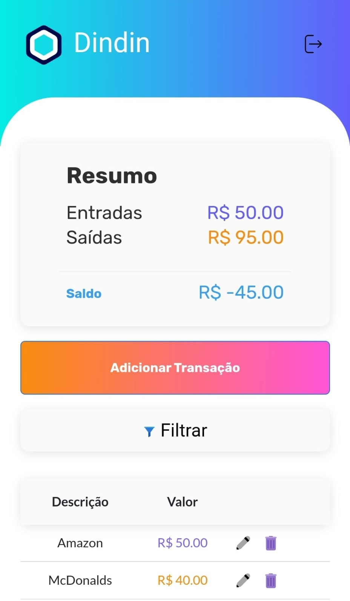

<h1 align="center">
     <a href="https://mydindin.netlify.app/" alt="site do ecoleta"> Dindin App </a> 
</h1>
<h3 align="center">
    It is a personal finance app!
</h3>
<div align="center">

[](./README-en.md) [](./README.md)

</div>
</br>
<a href='https://mydindin.netlify.app/'>

</a>

<p align="center">
  
  
  
  
  
  

  <a href="https://github.com/fiusks/dindinV2/commits/master">
    
  </a>
    
    
 
</p>

# Table of contents

<!--ts-->

- [About](#about)
- [Features](#features)
- [Layout](#layout)
  - [Mobile](#mobile)
  - [Web](#web)
- [How to run](#how-to-run)
  - [Requirements](#requirements)
  - [Backend (Server)](#backend-server)
  - [Frontend (Client)](#frontend-client)
- [Technologies](#technologies)
  - [Frontend](#frontend-react--typescript)
  - [Backend](#backend-nodejs--typescript)
- [Author](#author)
- [License](#license)
<!--te-->

## About

**Dindin** - is a financial manager that records transactions and allow users to track their balance and filter their transactions.

The original project was developed during the 4th module of the Software Development course offered by [Cubos Academy](https://cubos.academy/). During the course, the main goal of the project was to practice React using **Javascript** and **React Props**.

After completing the course, I decided to refactor the code using my **Typescript** and **Redux** skills. I also implemented responsiveness using the mobile first principle.

---

## Features

- [x] Users can register on the platform by seding the following data:

  - Name
  - Surname
  - E-mail
  - Password

- [x] Registered users can add, delete and edit transactions with the following data:
  - Type: "Debit or Credit"
  - Amount
  - Category
  - Date
  - Description
- [x] Registered users can filter transactions according to the following parameters:
  - Weekday
  - Category
  - Max value
  - Min value

---

## Layout

The original challenge was not designed for mobile, but during the refactoring process I made it responsive for mobile users.

### Mobile

<p align="center">
  <p align="center">
  
</p>

### Web

<p align="center" style="display: flex; align-items: flex-start; justify-content: center;">
  

</p>

---

## How to run

This project contains two parts:

1. Backend
2. Frontend

💡For the Frontend to work properly, you need to start the server first.

### Requirements

Before starting, you will the following tools installed on your machine:
[Git](https://git-scm.com), [Node.js](https://nodejs.org/en/).

Besides this, you will need to create a database according to the following [schema](./backend/schema.sql).

For this project, I used PostgreSQL as database, and Knex as a SQL Query Builder tool.

> Check documentation [Knex](http://knexjs.org/guide/#configuration-options)

After creating the database, pay attention to the creation of the **.env** file. You will need to fill it according to the [.env.example](./backend/.env.example) file.

#### Backend (Server)

```bash

# Clone this repository
$ git clone git@github.com:fiusks/dindinV2.git

# Go to the backend folder
$ cd backend

# Install needed dependecies
$ npm install

# Run the app in development mode
$ npm run dev

# The server will start on port :3001 - access http://localhost:3001

```

> **For more information, access the specific documentation here [backend](./backend/README.md)**

#### Frontend (Client)

```bash

# Clone this repository
$ git clone git@github.com:fiusks/dindinV2.git

# Go to the frontend folder
$ cd frontend

# Install needed dependecies
$ npm install

# Run the app in development mode
$ npm run start

# The app will start on port :3000 - access http://localhost:3000

```

> **For more information, access the specific documentation here [frontend](./frontend/README.md)**

---

## Technologies

#### **Frontend** ([React](https://reactjs.org/) + [TypeScript](https://www.typescriptlang.org/))

- **[Day.js](https://github.com/axios/axios)**
- **[React Bootstrap](https://react-icons.github.io/react-icons/)**
- **[React Hook Form](https://react-hook-form.com/)**
- **[React Router Dom](https://github.com/ReactTraining/react-router/tree/master/packages/react-router-dom)**
- **[React Toastfiy](https://github.com/fkhadra/react-toastify)**
- **[Redux Toolkit](https://github.com/axios/axios)**
- **[Saas](https://sass-lang.com/)**
- **[Yup](https://github.com/jquense/yup)**

> Check the [package.json](https://github.com/fiusks/dindinV2/blob/main/frontend/package.json) file

#### **Backend** ([NodeJS](https://nodejs.org/en/) + [TypeScript](https://www.typescriptlang.org/))

- **[Express](https://expressjs.com/)**
- **[Bycrypt](https://github.com/kelektiv/node.bcrypt.js#readme)**
- **[CORS](https://expressjs.com/en/resources/middleware/cors.html)**
- **[jsonwebtoken](https://github.com/auth0/node-jsonwebtoken)**
- **[Day.js](https://day.js.org/)**
- **[KnexJS](http://knexjs.org/)**
- **[PostgreSQL](https://www.postgresql.org/)**
- **[ts-node](https://github.com/TypeStrong/ts-node)**
- **[dotENV](https://github.com/motdotla/dotenv)**
- **[pg](https://github.com/brianc/node-postgres)**
- **[Yup](https://github.com/jquense/yup)**

> Check the [package.json](https://github.com/fiusks/dindinV2/blob/main/backend/package.json) file

---

## Author

<a href="https://blog.rocketseat.com.br/author/thiago/">
 
 <br />
 <sub><b>Rafael Barros</b></sub></a>

[](https://www.linkedin.com/in/rafabarros1/)
[](mailto:rafabarros.com@gmail.com)

---

## License

This project is under [MIT](./LICENSE) license.

---
